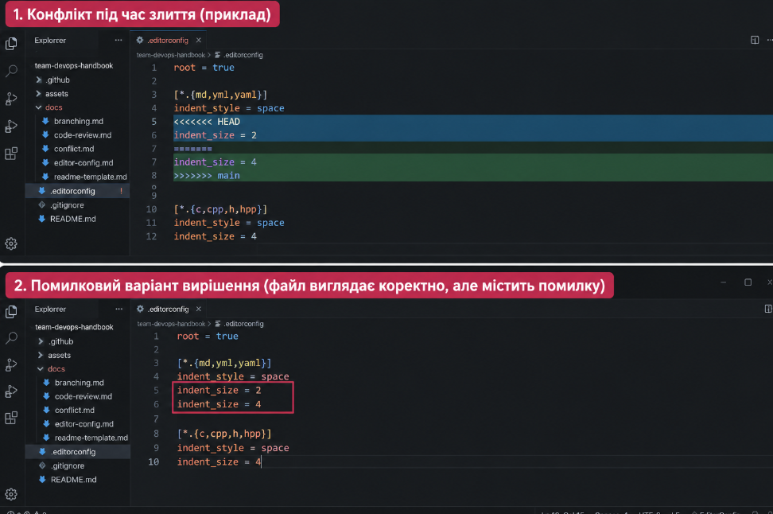
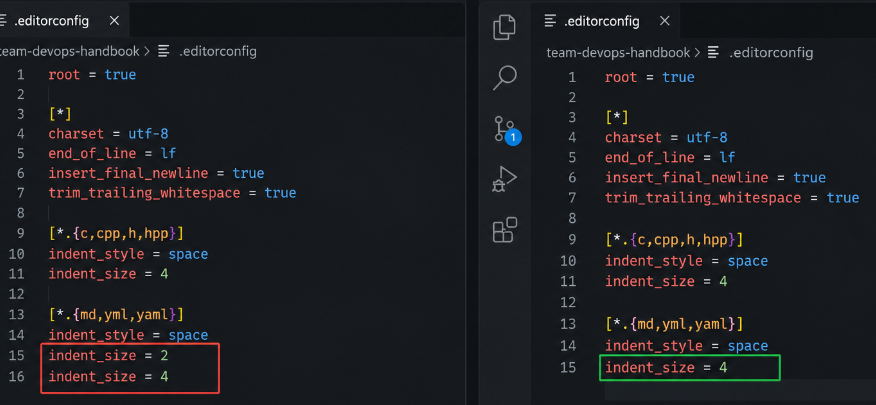

# Вирішення конфлікту в .editorconfig

Під час злиття виник конфлікт `add/add` у файлі `.editorconfig`, оскільки двоє учасників незалежно створили цей файл з різними значеннями `indent_size`.

## Помилковий спосіб вирішення

Видалити лише маркери конфлікту (`<<<<<<<`, `=======`, `>>>>>>>`), але залишити дубльований ключ:

```ini
[*.{md,yml,yaml}]
indent_style = space
indent_size = 2
indent_size = 4
```

Файл може залишитися синтаксично коректним і не видати помилку, але дубльований ключ змінює або робить неоднозначною поведінку редактора. Часто застосовується останнє значення, але це зменшує передбачуваність конфігурації.

## Правильний спосіб вирішення

Видалити маркери Git та залишити лише одне узгоджене значення:

```ini
[*.{md,yml,yaml}]
indent_style = space
indent_size = 4
```

Правильним є саме одне значення `indent_size = 4`, узгоджене командою. Воно усуває дублювання та гарантує однакові відступи для всіх учасників.



